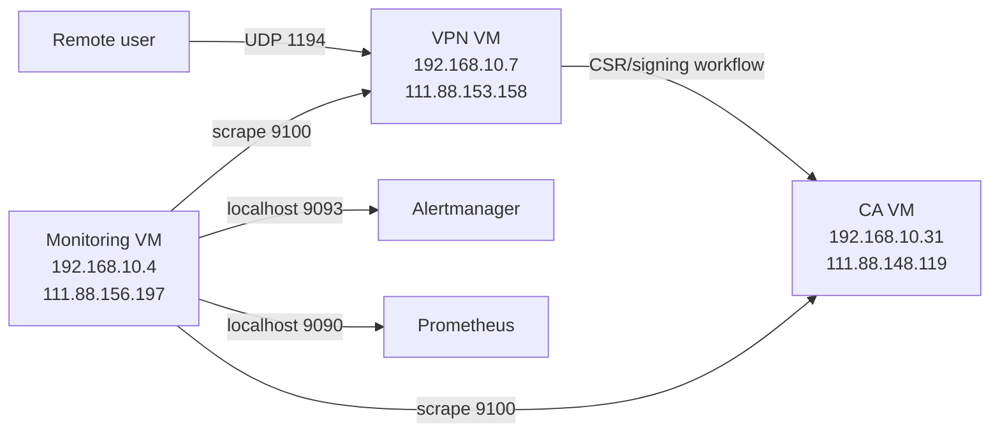

# Схема инфраструктуры

Схема инфраструктуры с серверами и IP-адресами.

## Узлы

- CA VM: `192.168.10.31` (`111.88.148.119`)
- VPN VM: `192.168.10.7` (`111.88.153.158`)
- Monitoring VM: `192.168.10.4` (`111.88.156.197`)
- Пользователи: внешние клиенты OpenVPN

## Логическая схема

## Роли серверов

- CA VM: выпуск и подпись сертификатов (PKI).
- VPN VM: точка входа пользователей во внутреннюю сеть.
- Monitoring VM: сбор метрик, хранение TSDB, вычисление алертов, отправка уведомлений.

## Примечания

- Внутренние IP используются для межсерверного взаимодействия.
- Внешние IP используются для администрирования и клиентского VPN-подключения.
