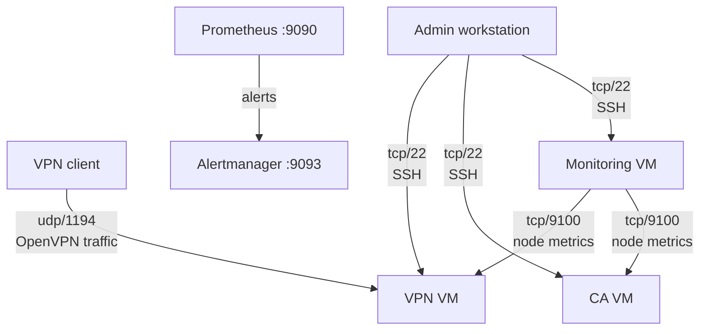

# Схема потоков данных

Этот документ показывает, какие серверы обмениваются данными, по каким портам и что передается.

## Основные потоки

1. Пользователь -> VPN VM:
   - Протокол/порт: `udp/1194`
   - Данные: VPN-трафик и туннелирование в приватную сеть
2. Monitoring VM -> VPN VM:
   - Протокол/порт: `tcp/9100`
   - Данные: инфраструктурные метрики node_exporter
3. Monitoring VM -> CA VM:
   - Протокол/порт: `tcp/9100`
   - Данные: инфраструктурные метрики node_exporter
4. Prometheus -> Alertmanager (на Monitoring VM):
   - Протокол/порт: `tcp/9093`
   - Данные: события алертов
5. Администратор -> VM:
   - Протокол/порт: `tcp/22`
   - Данные: SSH-администрирование, деплой скриптов и пакетов

## Диаграмма потоков

## Политика доступа (кратко)

- `9100/tcp` на CA/VPN должен быть доступен только с Monitoring VM.
- `1194/udp` открыт для VPN-клиентов.
- `22/tcp` ограничен администраторскими адресами.
